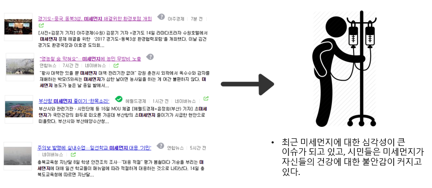
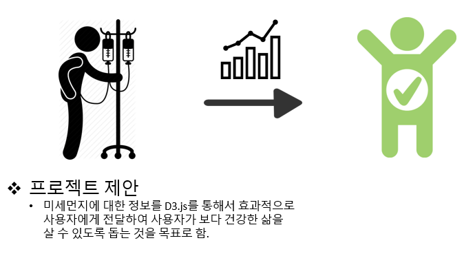
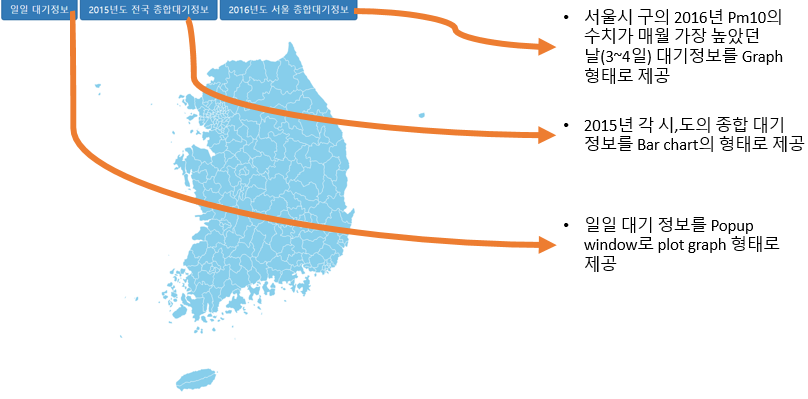
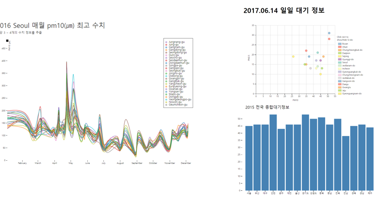

Micro Dust Map
================
- Team: 이승룡
- index url: https://snuhci2017.github.io/MicroDustMap/
- 미세먼지에 대한 정보를 사용자에게 전달하여 건강한 삶에 도움을 주는 것을 목표로 함 

## 배경

## 참고자료
대기환경 정보: [Air Korea](https://www.airkorea.or.kr/index) 
korea map data: [South Korea maps](https://github.com/southkorea/southkorea-maps) 
d3 api: [D3](https://github.com/d3/d3)

페르소나
--------------------------
**Primary Persona** 
* 과거의 축적 Data를 확인하고 이를 바탕으로 정책을 추진하는 정치인 또는 미세먼지 수치가 높은 시기를 파악해 미세먼지 발생시 피해를 감소할 수 있는 물품을 파는 사업가 등
 
**Second Persona**
* 평소 환경적 정보에 관심이 많은 사람 또는, 최근에 이슈가 되는 정보에 대한 일시적 호기심, 또는 자신의 건강에 대해서 큰 관심이 있는 사람

동작 화면
------------------------------

